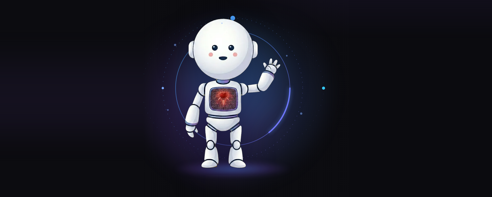
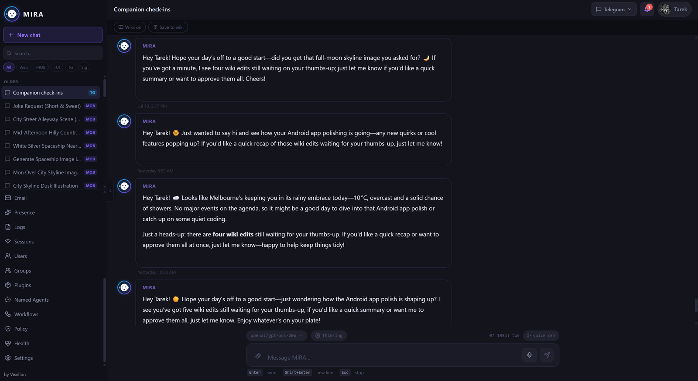
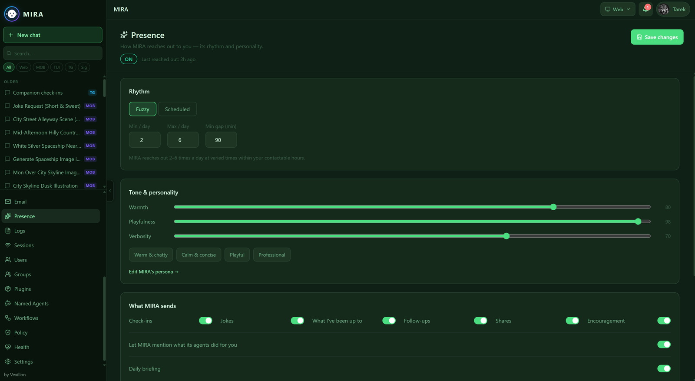
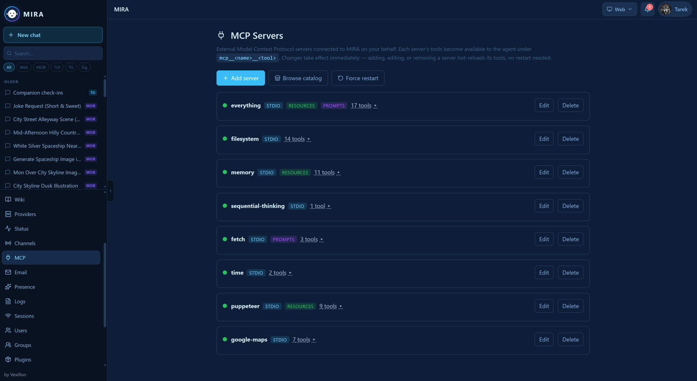
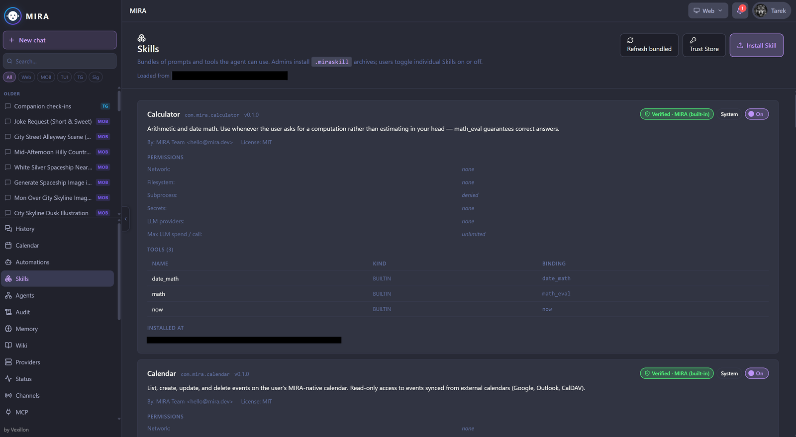
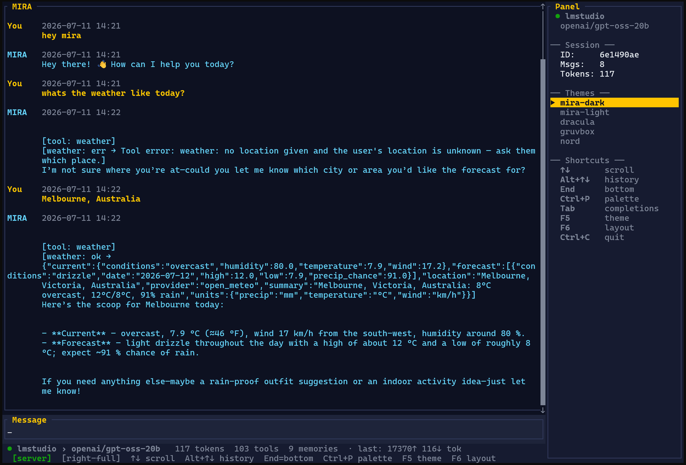
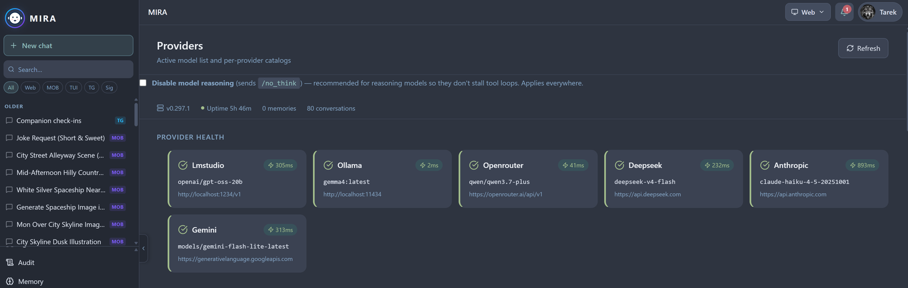

<div align="center">



# MIRA

**Multi-tasking Intelligent Responsive Assistant**

*"Your life's loyal partner. Always ready to assist."*

A self-hosted personal AI agent that runs on **your** hardware and reaches you on the apps you already use — Signal, Telegram, Discord, the web, and more.
A project of **[Vexillon](https://vexillon.ai)**.

<br/>

[](LICENSE)
[](https://github.com/Vexillon-ai/MIRA/releases)
[](#install)
[](https://www.rust-lang.org/)
[](https://github.com/Vexillon-ai/MIRA/releases/tag/v0.272.0)

**[Documentation](docs/) · [Install](#install) · [Releases](https://github.com/Vexillon-ai/MIRA/releases) · [Issues](https://github.com/Vexillon-ai/MIRA/issues)**

</div>

---

## 📸 Screenshots

<div align="center">

<table>
<tr>
<td width="50%"><br/><sub><b>Proactive check-ins</b> — MIRA reaches out first</sub></td>
<td width="50%"><br/><sub><b>Presence</b> — tune its rhythm &amp; personality</sub></td>
</tr>
<tr>
<td width="50%"><br/><sub><b>MCP</b> — extend it with external tool servers</sub></td>
<td width="50%"><br/><sub><b>Skills</b> — bundled tools, scoped permissions</sub></td>
</tr>
<tr>
<td width="50%"><br/><sub><b>Terminal UI</b> — the full agent in your shell</sub></td>
<td width="50%"><br/><sub><b>Providers</b> — multi-provider health at a glance</sub></td>
</tr>
</table>

</div>

---

## Why MIRA

Most AI assistants live in **one app**, on **someone else's cloud**, with a memory that **resets every conversation**. MIRA inverts all three:

- 🏠 **Yours.** One Rust binary on hardware you control. Conversations, memory, and provider keys never leave the box.
- 📩 **Reaches you where you are.** Not a feed to open — a contact that texts you on Signal, Telegram, Discord, Matrix, WhatsApp, Slack, email, or the web. It can start the conversation, too.
- 🧠 **Remembers you.** A growing store of facts about you plus a hand-editable wiki — the same context across channels and across months.
- 🛡️ **Built safe.** Memory-safe Rust core, opt-in sandboxing for code execution, least-privilege elevation, per-user accounts, and an audit trail.

---

## ✨ Features

| | |
| --- | --- |
| 💬 **Channels** | Web, Telegram, Signal, Discord, Matrix, WhatsApp, Slack, Email (IMAP/SMTP + OAuth), Web Push — plus external channels over the Channel Provider Protocol ("MCP for channels"). |
| 🔔 **Proactive / companion** | Quiet-hours-aware check-ins and a daily briefing built from your calendar, wiki, and automations — per-user, opt-in, as text or voice. |
| 🎙️ **Voice** | Built-in TTS (Kokoro, Piper, eSpeak, OpenAI-compatible) and STT (Whisper), with per-channel routing and per-user policy. |
| 🧠 **Memory & knowledge** | Auto-extracted atomic facts with semantic recall, optional experimental knowledge-graph memory, and a per-user + system wiki. |
| 🛠️ **Tools** | Web search/fetch, URL preview, sandboxed code execution, opt-in shell, calendar, PDF extraction, summarisation, history recall, background sub-agents. |
| 🔌 **MCP host mode** | Connect external MCP servers (stdio or Streamable-HTTP); tools hot-reload and surface as `mcp__<server>__<tool>`. |
| ⏰ **Automations** | Cron-scheduled and event-triggered actions, plus internal heartbeats (watchdog, memory janitor, rollups). |
| 🧩 **Skills & agents** | Signed, packaged units of capability, and spawnable background sub-agents. |
| 🔐 **Security & multi-user** | Per-user JWT accounts, admin/user roles, a tool-policy layer, a per-skill secrets vault (AES-256-GCM), secret redaction, optional nginx reverse proxy. |
| ♻️ **Backup & restore** | One-click or scheduled encrypted backup of the whole data directory, with a safe two-phase restore. |

<details>
<summary><strong>More detail on each area</strong></summary>

- **Channels** — Web chat, Telegram, Signal, Email (IMAP/SMTP + OAuth + webhooks), Discord, Matrix, WhatsApp, Slack, external plugin channels (Channel Provider Protocol), shared bots with identity linking, and Web Push.
- **Proactive / companion** — scheduled check-ins (quiet-hours aware) and a daily briefing built from your calendar, wiki, and automation runs; per-user, opt-in, deliverable as text or voice.
- **Voice** — TTS backends (Kokoro, Piper, eSpeak, OpenAI-compatible) and STT (whisper), with per-channel routing and per-user voice policy.
- **Memory & knowledge** — auto-extracted atomic facts with topic-grouped semantic recall, an optional experimental knowledge-graph memory, and a per-user + system **wiki**.
- **Tools** — web search, web fetch / URL preview, sandboxed code execution, opt-in shell, calendar, PDF extraction, date/time, summarisation, history recall, and background sub-agents.
- **MCP host mode** — connect external MCP servers (stdio or Streamable-HTTP) with a built-in admin-managed catalog; tools hot-reload and surface as `mcp__<server>__<tool>`.
- **Automations** — cron-scheduled and event-triggered actions, plus internal heartbeats (watchdog, memory janitor, rollups).
- **Skills & agents** — signed, packaged units of capability, and spawnable background sub-agents.
- **Security & multi-user** — per-user JWT accounts, admin/user roles, a tool policy layer, a per-skill secrets vault (AES-256-GCM), redaction of secrets on read, and an optional nginx reverse proxy.
- **Reasoning auto-routing** — optionally detect "hard" turns and route them to a stronger reasoning model automatically.
- **Backup & restore** — one-click (or scheduled) encrypted backup of the entire data directory, with a safe two-phase restore.

</details>

MIRA also ships this documentation **built in** — ask it *"what can you do?"* See [`mira-docs/features.md`](mira-docs/features.md) for the full tour.

---

## Overview

**MIRA** is a self-hosted personal AI agent. You run it on your own hardware; it talks to whichever LLM provider you configure (Anthropic, OpenAI, OpenRouter, DeepSeek, Gemini, or a local / OpenAI-compatible server). Your conversations, memory, and data stay on your machine.

The core is **Rust** (~156k LOC) for a small, memory-safe, edge-deployable footprint, with a React web UI and a terminal UI.

**Design principles**

1. **Self-hosted & private** — your data lives in your data directory, on your hardware.
2. **Safety first** — Rust core; opt-in Linux sandbox and container/native runtime confinement for code execution; a least-privilege privileged helper for the few elevated operations.
3. **Extensible via traits** — pluggable channels, tools, providers, and skills.
4. **Proactive** — background memory, companion check-ins, scheduled automations.
5. **Transparent** — tool/thinking traces in the UI, comprehensive logging, an audit trail.

---

## Install

> **Public beta.** Every release archive ships with a `SHA256SUMS` and a minisign `.minisig` signature — see [verifying a download](#verify-a-download) below.

**Quick install** — Linux / macOS:

```bash
curl -fsSL https://get.vexillon.ai/install.sh | sh
```

**Quick install** — Windows (PowerShell):

```powershell
irm https://get.vexillon.ai/install.ps1 | iex
```

The installer detects your platform, downloads and verifies the signed build, places `mira` on your `PATH`, and runs the guided `mira setup`. Pin a version with `… | sh -s -- --version 0.272.0` (or `-Version 0.272.0` on Windows).

**Or download manually** — grab the archive for your platform from [Releases](https://github.com/Vexillon-ai/MIRA/releases), extract the `mira` binary onto your `PATH`, then run the guided setup:

```bash
mira setup        # admin account, LLM provider, security
mira install      # register the OS service (systemd / launchd / Windows SCM)
# then finish onboarding in the web UI
```

**Docker** — the repo ships a multi-stage `Dockerfile` (web build → rust build → slim Debian runtime with JRE + signal-cli) and a `docker-compose.yml`:

```bash
docker compose up -d
# open http://localhost:8080   (MIRA_PORT=9090 to change the host port)
```

The compose file mounts `./data` into the container at `/data` (config, history DB, signal-cli keystores, logs) — back up that directory to back up your install. Inside the container the Docker daemon is the supervisor: `restart: unless-stopped` honours the web UI's **Restart** button.

See the [installation guide](docs/getting-started/installation.md) for the full deployment matrix.

### Verify a download

```bash
sha256sum -c SHA256SUMS
minisign -Vm mira-<version>-<target>.tar.gz \
  -P RWQX8PcjZB3S8i1V9AkZgUKoIy+eZWRzaEHKvBW9U/mkMP9Vp0B8xOaO
# trusted comment must read: signed by vexillon.ai — MIRA <version>
```

---

## Architecture

<details open>
<summary><strong>System overview</strong></summary>

```
┌──────────────────────────────────────────────────────────────┐
│  CHANNELS                                                      │
│  Web · Telegram · Signal · Discord · Matrix · WhatsApp ·      │
│  Slack · Email · Web Push · External providers (CPP)          │
└───────────────────────────┬──────────────────────────────────┘
                            ▼
┌──────────────────────────────────────────────────────────────┐
│  GATEWAY  (single process: HTTP/web API · channel pollers ·   │
│            schedulers · auth)                                  │
│                                                              │
│   Agent core ── Model router (multi-LLM)                      │
│      │          Memory + Wiki                                 │
│      │          Tool registry · MCP host                     │
│      │          Skills · Sub-agents                          │
│      │          Automations / scheduler                      │
└──────┼───────────────────────────────────────────────────────┘
       ▼
   Data directory (~/.mira/data): auth/user DB, memory DB, wiki,
   companion DB, automations, channel accounts, artifacts, TTS models
```

A single **gateway** process hosts the agent, the HTTP/web API, the channel pollers, and the schedulers. **Global/operator settings** live in `mira_config.json` (admin-managed); **per-user settings** (voice, companion, channel accounts, connected MCP servers) live per account.

</details>

<details>
<summary><strong>Repository structure</strong></summary>

```
mira/
├── src/                 # Rust core (~156k LOC)
│   ├── gateway/         # HTTP/web API, routing, control plane
│   ├── agent/           # agent loop, tool orchestration
│   ├── providers/       # LLM provider adapters (Anthropic, OpenAI, …)
│   ├── channel*/        # channel framework + per-channel impls
│   ├── discord, matrix, slack, whatsapp, email   # built-in channels
│   ├── memory/, wiki/   # memory + knowledge
│   ├── tools/           # built-in tools
│   ├── mcp/             # MCP host mode
│   ├── automations/, companion/   # scheduling + proactive
│   ├── skills/          # skills system
│   ├── tts/, stt/, voice/         # speech
│   ├── sandbox/, packages/, privhelper/   # execution confinement + elevation
│   ├── security/, policy/, auth/  # multi-user security
│   └── tui/, server/    # terminal UI + server mode
├── web/                 # React web UI + landing page
├── docs/                # public user documentation (guides, how-tos, reference)
├── mira-docs/           # built-in self-knowledge docs (compiled into the binary)
├── config/              # config schema
├── bundled-skills/      # skills shipped with MIRA
├── Dockerfile, docker-compose.yml
├── LICENSE              # GNU AGPL-3.0
└── NOTICE               # copyright + license summary
```

</details>

---

## License

Copyright (C) 2026 Tarek El Diab — a project of [Vexillon](https://vexillon.ai).

This program is free software: you can redistribute it and/or modify it under the terms of the **GNU Affero General Public License, version 3** (or, at your option, any later version) as published by the Free Software Foundation. See the [`LICENSE`](LICENSE) file for the full text.

It is distributed WITHOUT ANY WARRANTY; without even the implied warranty of MERCHANTABILITY or FITNESS FOR A PARTICULAR PURPOSE. Because MIRA can be operated over a network, the AGPL's §13 applies: if you run a modified version as a network service, you must offer its users the corresponding source.

---

## Acknowledgments

MIRA's design drew on a comparative study of existing agent frameworks — OpenClaw, ZeroClaw, IronClaw, memU, SuperAGI, Hermes Agent, nanobot, and Agent Zero. All are open-source projects with their own licenses; see their respective repositories.

---

## Contact

- **Issues**: [GitHub Issues](https://github.com/Vexillon-ai/MIRA/issues)
